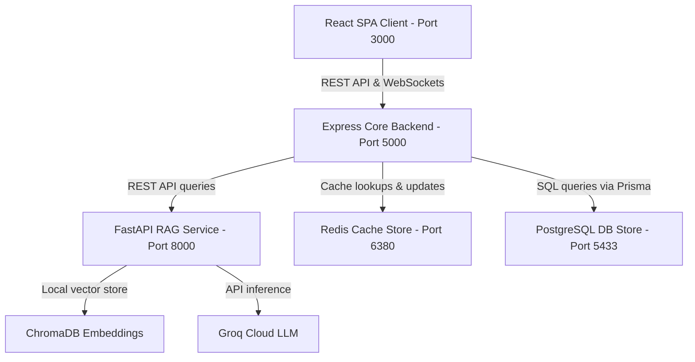

# MedCare HMS System Architecture

This document describes the complete architecture, stack details, communication patterns, and database model of the MedCare Hospital Management System (HMS).

---

## 1. System Overview & Service Topology

The system is deployed using a decoupled, service-oriented architecture consisting of five main containers managed under a single orchestrator, completely eliminating any middle reverse proxies (like Nginx) to maximize throughput and developer simplicity.



### 1.1 Core Components & Port Mapping
* **Frontend SPA**: React (Vite/CRA) bundle compiled down and served locally on port `3000`.
* **Core API Backend**: Node.js + Express server running on port `5000`.
* **AI RAG Pipeline**: Python FastAPI server executing on port `8000`.
* **Cache Layer**: Redis Server listening on external port `6380`.
* **Database Layer**: PostgreSQL Server listening on external port `5433`.

---

## 2. Technology Stack & Directory Structure

### 2.1 Backend Core
* **Express.js**: Core framework for routing, rate limiting, and HTTP middleware.
* **Prisma ORM**: Modern database client mapping JS models to PostgreSQL tables. Manages migrations, joins, and transaction rollbacks.
* **Socket.IO**: WebSocket protocol server enabling real-time bi-directional messaging between patients and doctors.
* **Passport.js**: Authentication wrapper integrating Google OAuth 2.0.
* **Redis Client**: Asynchronous cache engine with customized caching handlers.

### 2.2 Frontend SPA
* **React**: Component-driven library managing declarative DOM updates.
* **Redux Toolkit**: Centralized store managing token sessions, persistent authentication state, and user details.
* **React Router Dom (v6)**: Dynamic client-side routing with route-level protection (`ProtectedRoute`).
* **Socket.IO Client**: Establishes persistent WebSockets connections using JWT bearer handshakes.
* **Vanilla CSS Glassmorphism**: Tailored CSS tokens (`index.css`) defining premium translucent backdrops, layout structures, and animated UI state transitions.

### 2.3 Python RAG Service
* **FastAPI**: Uvicorn-hosted Python HTTP API framework.
* **LangGraph**: Orchestrates the multi-node workflow graph (`analyze_query` ➔ `hybrid_retrieve` ➔ `rerank_docs` ➔ `generate_answer`).
* **ChromaDB**: SQLite-backed dense vector index storing chunks embedding via `all-MiniLM-L6-v2`.
* **Rank-BM25**: Sparse retrieval algorithm scoring keyword relevance based on document frequency.
* **LangChain Groq**: Invokes `llama-3.1-8b-instant` with structured context and system instructions.

---

## 3. Database Schema Design (Prisma)

The relational schema maps domain rules to highly-normalized PostgreSQL tables.

```prisma
model User {
  id           String          @id @default(uuid())
  name         String
  email        String          @unique
  phone        String          @default("")
  passwordHash String          @default("")
  googleId     String?         @unique
  avatar       String?
  role         Role            @default(PATIENT)
  isActive     Boolean         @default(true)
  createdAt    DateTime        @default(now())
  
  patientProfile PatientProfile?
  doctorProfile  DoctorProfile?
  // Relations to appointments, prescriptions, chat sessions
}
```

### 3.1 Essential Domain Models
1. **User / PatientProfile / DoctorProfile**: Standard 1-to-1 extension schema. DoctorProfile holds metadata (fee, slots duration, availability days).
2. **Appointment**: Tracks status (`PENDING`, `CONFIRMED`, `COMPLETED`, `CANCELLED`). Connects doctor and patient with date, start time, end time, visit type, and payment parameters.
3. **Prescription & PrescriptionTemplate**: Connects medication details (Json format) and advice to appointments. Doctors can persist pre-configured sets of prescriptions as templates.
4. **MedicalRecord**: Stores diagnoses, tests ordered, results, and prescription mappings.
5. **ChatSession & ChatMessage**: Stores session IDs and messages between doctor-patient combinations with read receipt markers (`isRead`).

---

## 4. Key Functional Workflows

### 4.1 Hybrid Retrieval Augmented Generation (RAG)
To provide fast, cost-efficient, and accurate responses, we fuse sparse and dense matching models:

```
[User Query] ──> Classify Query (Schedule, Medical, General)
                    │
                    ├──> Dense Retrieval (ChromaDB + all-MiniLM-L6-v2) ──┐
                    │                                                     ├──> RRF Fusion ──> Keyword Rerank ──> Groq LLM
                    └──> Sparse Retrieval (BM25 Okapi search) ───────────┘
```

1. **Query Classifier**: Evaluates keyword groups to tag query types.
2. **Dense Semantic Retrieval**: Employs cosine-similarity matches against a ChromaDB collection to retrieve contextually similar documents.
3. **Sparse Keyword Match**: BM25 evaluates document matches for exact medical terminology (e.g. specific drug names).
4. **Reciprocal Rank Fusion (RRF)**: Combines dense and sparse results into a consolidated rank list using rank scoring formula:
   \[ RRF(d) = \sum_{m \in M} \frac{1}{k + r_m(d)} \]
5. **Reranker**: Sorts the fused top-5 results based on query token intersection density to output the final context snippet.

### 4.2 WebSockets Messaging Protocol
Real-time chat is established via a authenticated Socket.IO channel:
1. Client connects, supplying `accessToken` in the socket auth payload.
2. Server validates JWT; on success, joins room `user:${userId}`.
3. Chat messaging:
   - Client sends `send_message` with `receiverId`, `message`, and `sessionId`.
   - Backend persists the message inside Prisma database.
   - Backend broadcasts the new message payload to both the sender and receiver's rooms (`user:${senderId}` and `user:${receiverId}`).
   - Receiver updates active session and increments unread count automatically.

### 4.3 Redis Caching Strategy
Caching is deployed on all read-intensive REST endpoints:
* **Cache Hits**: Retrieves payload from Redis using deterministic key (e.g., `patient:profile:${userId}`).
* **Cache Misses**: Retrieves from PostgreSQL DB, stores in Redis with a TTL of 120-300 seconds, and returns.
* **Invalidation**: On edit/update/cancellation requests, pattern-based deletion (e.g. `deleteCachePattern("patient:appointments:${userId}:*")`) removes outdated caches.

---

## 5. Security & Verification Measures
* **Passport Google OAuth 2.0**: Implements passport callbacks. Auto-registers new users safely under the default `PATIENT` role.
* **Secure Middleware**: `authenticate` extracts and decodes the JWT bearer token, throwing an `ApiError(401)` on expiration. `authorize` gates routes to specific roles.
* **Error handling**: Centralized error interceptor (`errorHandler`) translates database faults, ORM validation failures, and authorization exceptions into standardized JSON payloads.
